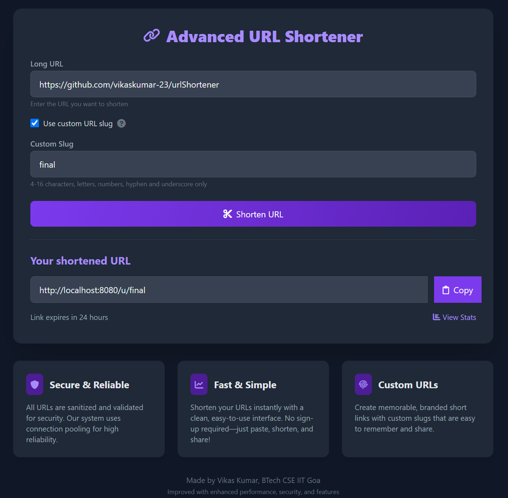

# URL Shortener

A simple, self-hosted URL shortener built in C++ using [cpp-httplib](https://github.com/yhirose/cpp-httplib) and SQLite.
Short URLs expire after 24 hours.

---

## Features

* **Shorten URLs** via a REST API (`/shorten`).
* **Redirect** from `/u/{code}` to the original URL.
* **Expiry**: each short URL is valid for 24 hours (configurable).
* **Thread-safe** SQLite access with automatic cleanup of expired entries.
* **Web UI** built with plain HTML, JavaScript, and TailwindCSS.

---

## Prerequisites

* **C++17** compiler (g++ on Linux, MSVC or MinGW on Windows)
* **SQLite3** development library
* **git**, **curl** or **wget** (optional, to fetch `httplib.h`)

---

## Repository Structure

```
.
├── README.md
├── main.cpp       # application source
├── index.html     # web UI
└── httplib.h      # single-header HTTP library
```

---

## Setup on Ubuntu

1. **Install system packages**

   ```bash
   sudo apt update
   sudo apt install -y build-essential libsqlite3-dev git wget
   ```

2. **Clone the repository**

   ```bash
   git clone https://github.com/yourusername/url-shortener.git
   cd url-shortener
   ```

3. \*\*Fetch \*\***`httplib.h`** (if not included)

   ```bash
   wget -O httplib.h https://raw.githubusercontent.com/yhirose/cpp-httplib/master/httplib.h
   ```

4. **Compile**

   ```bash
   g++ -Iinclude -std=c++17 -o new new.cpp -lsqlite3 -lpthread -lws2_32
   ```

5. **Run**

   ```bash
   ./url_shortener
   ```

   * Server runs on `http://localhost:8080/`
   * Short URLs expire after 24 hours.

---

## Setup on Windows

> Tested on Windows 10/11 with MinGW-w64

1. **Install MSYS2** from [https://www.msys2.org/](https://www.msys2.org/) and open the MSYS2 Mingw64 shell.

2. **Install packages**

   ```bash
   pacman -Syu
   pacman -S mingw-w64-x86_64-gcc mingw-w64-x86_64-sqlite3 git wget
   ```

3. **Clone the repository**

   ```bash
   git clone https://github.com/yourusername/url-shortener.git
   cd url-shortener
   ```

4. \*\*Fetch \*\***`httplib.h`** (if not included)

   ```bash
   wget -O httplib.h https://raw.githubusercontent.com/yhirose/cpp-httplib/master/httplib.h
   ```

5. **Compile**

   ```bash
   g++ -Iinclude -std=c++17 -o new new.cpp -lsqlite3 -lpthread -lws2_32
   ```

6. **Run**

   ```bash
   ./url_shortener.exe
   ```

   * Visit `http://localhost:8080/` in your browser.

---

## Usage

1. **Open** `index.html` in your browser or navigate to `http://localhost:8080/`.
2. **Enter** a long URL and click **Shorten**.
3. **Copy** the generated short link (e.g. `http://localhost:8080/u/abcdef`).
4. **Visit** that link within 24 hours to be redirected.

---

## Configuration

* **Expiry**: modify `EXPIRY_HOURS` constant in `main.cpp`.
* **Port & Host**: change `svr.listen("localhost", 8080);` in `main.cpp`.
* **Database file**: defaults to `url_map.db` in the working directory.

